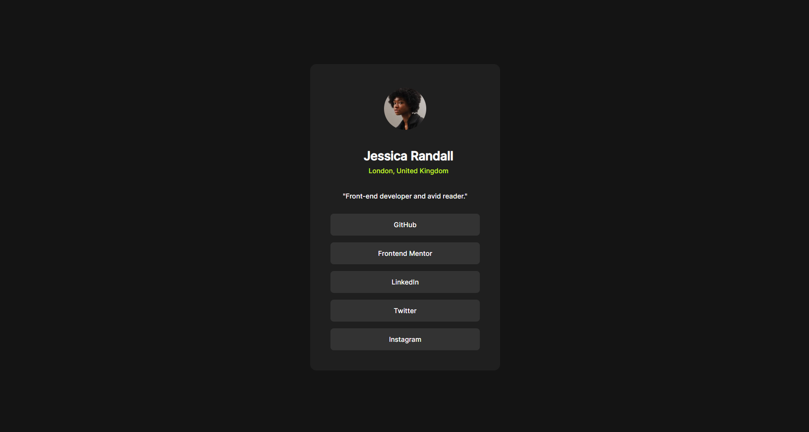

### Screenshot

### Links

Live Site URL:

### My Process

As usual, I first structured the html file, set up the css file, and modified the css so I can match the preview as much as I can. This time, I hard coded values so I can accurately match the design. I don't think that it is perfect but I think it matches the look of the page.

### Built with

- Semantic HTML5 markup
- CSS custom properties
- Flexbox
- Desktop-first workflow

### My own learning

I got frustrated by the values I used. I hard coded almost all of the sizing and it is kind of unsatifsying knowing that it would be unresponsive in some case.

### continued Development

In my next projects, I will try my best to make all of the sizing consistent and responsive

### Author

- Github - https://github.com/Zzzylo
- Frontend Mentor - https://www.frontendmentor.io/profile/Zzzylo
- Linked in - https://www.linkedin.com/in/zylo-lanard-vilarde-454aa5419/
